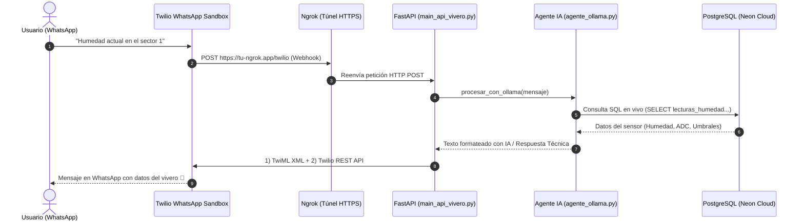

# 📱 Guía de Integración Twilio WhatsApp & Agente IA (Ollama)

Este documento detalla la arquitectura, el flujo de comunicación y la configuración técnica del bot de **WhatsApp** integrado con **Twilio**, **FastAPI**, **Ollama (Llama 3.2)** y **PostgreSQL (Neon Cloud)** para el sistema de monitoreo y riego del vivero.

---

## 🏗️ 1. Arquitectura General del Sistema

El flujo completo desde que envías un mensaje en tu celular hasta que recibes la respuesta técnica en tiempo real funciona así:



---

## 🧩 2. Componentes Clave

### A. Twilio WhatsApp Sandbox
* **¿Qué es?** Un entorno de pruebas gratuito provisto por Twilio que simula un número corporativo de WhatsApp Business (`+1 415 523 8886`).
* **Función:** Recibe los mensajes entrantes de WhatsApp y los convierte en solicitudes HTTP (`POST`) dirigidas a un **Webhook**.

### B. Ngrok
* **¿Por qué se necesita?** Tu servidor FastAPI corre localmente en tu computadora (`http://localhost:8000`), a la cual los servidores en la nube de Twilio no tienen acceso directo.
* **Función:** Crea un túnel público seguro en Internet (`https://xxxx-xx.ngrok-free.app`) que redirige el tráfico entrante hacia tu puerto local `8000`.

### C. FastAPI (`main_api_vivero.py`)
* Expone los endpoints de webhook:
  - `/twilio`
  - `/webhook/twilio`
  - `/`
* Recibe el formulario enviado por Twilio (`From`, `Body`, etc.), coordina el procesamiento con el agente y devuelve la respuesta.
* **Estrategia Híbrida de Envío:**
  1. **Twilio REST API Directo:** Llama a `twilio_client.messages.create(...)` con tus credenciales.
  2. **TwiML XML de Respaldo:** Retorna un XML `<Response><Message>...</Message></Response>`.

### D. Agente Ollama (`agente_ollama.py`)
* Modelo de IA local: **`llama3.2:1b`**.
* **Capa de Razonamiento y Respuestas Rápidas:**
  - Si la pregunta solicita un dato crítico (humedad, tanque de agua, últimos riegos, encargados), consulta directamente la base de datos para responder de inmediato (< 1 segundo), evitando el timeout de Twilio.
  - Para preguntas abiertas, utiliza el LLM para razonar agronómicamente basándose en la telemetría viva del vivero.

---

## ⚙️ 3. Configuración Paso a Paso

### 1. Variables de Entorno (`.env`)
En el archivo `.env` de la raíz del proyecto se configuran las credenciales:

```env
# --- TWILIO WHATSAPP INTEGRATION ---
TWILIO_ACCOUNT_SID=ACxxxxxxxxxxxxxxxxxxxxxxxxxxxxxxxx
TWILIO_AUTH_TOKEN=tu_auth_token_aqui
TWILIO_WHATSAPP_NUMBER=whatsapp:+14155238886

# --- OLLAMA LOCAL LLM ---
OLLAMA_MODEL=llama3.2:1b
OLLAMA_HOST=http://localhost:11434
```

### 2. Encender la Infraestructura Local
Abre **dos terminales**:

* **Terminal 1: Servidor de la API**
  ```powershell
  python main_api_vivero.py
  ```
* **Terminal 2: Túnel Ngrok**
  ```powershell
  ngrok http 8000
  ```

### 3. Configurar el Webhook en la Consola de Twilio
1. Ingresa a la consola de [Twilio](https://console.twilio.com/).
2. Ve a **Messaging** > **Try it out** > **Send a WhatsApp message** (Sandbox Settings).
3. En la sección **Sandbox Settings**, busca el campo:
   * **`WHEN A MESSAGE COMES IN`**
4. Coloca la URL generada por Ngrok seguida de `/twilio`, por ejemplo:
   ```text
   https://tu-dominio.ngrok-free.app/twilio
   ```
5. Asegúrate de que el método sea **`HTTP POST`**.
6. Haz clic en **Save**.

### 4. Vincular tu Teléfono al Sandbox de WhatsApp
1. Agrega a tus contactos el número de WhatsApp de Twilio: **`+1 415 523 8886`**.
2. Envía un mensaje con el código asignado por tu Sandbox, por ejemplo:
   ```text
   join square-breeze
   ```
3. Twilio responderá confirmando que estás conectado al Sandbox. *(Recuerda: la sesión del Sandbox dura 72 horas; si expira, solo vuelve a enviar el comando `join ...`)*.

---

## 💬 4. Preguntas y Prompts de Demostración

| Categoría | Mensaje a enviar por WhatsApp | Qué responde el bot |
| :--- | :--- | :--- |
| **Sensores IoT** | `Humedad actual` | Porcentaje de humedad en vivo de todos los sectores y lecturas de los sensores. |
| **Sector Específico** | `¿Cómo está la humedad en el sector 1?` | Lectura del sensor capacitivo, valor ADC y si requiere activar la bomba. |
| **Historial de Riego** | `Últimos riegos` | Lista de los riegos recientes, duración en segundos y litros consumidos. |
| **Seguridad de Bomba** | `¿Hay alertas en el tanque de agua?` | Estado del interruptor flotador de nivel (evita operar en seco). |
| **Administración** | `¿Quiénes son los encargados de los sectores?` | Datos del personal asignado, cultivo y correos de contacto. |
| **IA / Recomendación** | `¿Me recomiendas regar hoy basándote en la humedad?` | Análisis experto cruzando datos de los sensores y tipo de planta. |

---

## 🛠️ 5. Preguntas Frecuentes y Solución de Errores

### ¿Por qué Twilio da error `404 Not Found`?
Ocurre si la URL en la consola de Twilio no coincide con la ruta registrada en FastAPI. Nuestro código escucha en:
- `/twilio`
- `/webhook/twilio`
- `/`

### ¿Por qué la terminal muestra el mensaje pero no me llega al celular?
1. Tu sesión en el Sandbox de Twilio pudo haber expirado (>72 hrs). Envía de nuevo `join <código>` al número de Twilio.
2. Si reinicias Ngrok, la URL cambia (en la versión gratuita). Recuerda actualizar la URL en la consola de Twilio cada vez que abras una nueva sesión de Ngrok.
